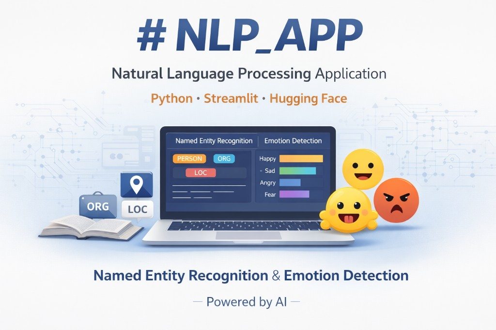

## NLP_APP — Natural Language Processing Application

[](https://kratulhub-nlp-app-streamlit-app-o9zdgb.streamlit.app/)

[**Live demo**](https://kratulhub-nlp-app-streamlit-app-o9zdgb.streamlit.app/)

[](https://kratulhub-nlp-app-streamlit-app-o9zdgb.streamlit.app/)

### Overview
`NLP_APP` is a lightweight NLP application built with **Python** + **Streamlit** and powered by **Hugging Face Inference API**.
It supports quick text analysis for:

- **Named Entity Recognition (NER)** (people, organizations, locations)
- **Emotion Detection** (joy, sadness, anger, fear, etc.)

### Models used
- **NER**: `dslim/bert-base-NER`
- **Emotion**: `j-hartmann/emotion-english-distilroberta-base`

### Key features
- **Fast UI**: simple Streamlit interface
- **Safer deployments**: token is loaded from **Secrets / env vars**, never hardcoded
- **User-friendly errors**: clear message when `HF_TOKEN` is missing/invalid

---

## Run locally
### 1) Install

```bash
python -m venv venv

# Windows PowerShell
.\venv\Scripts\Activate.ps1

pip install -r requirements.txt
```

### 2) Set Hugging Face token (required)
Create a Hugging Face access token and set it as an environment variable.

**Windows PowerShell**

```powershell
$env:HF_TOKEN="hf_..."
```

### 3) Start the Streamlit app

```bash
streamlit run streamlit_app.py
```

---

## Deploy on Streamlit Community Cloud
### 1) Create the app
- **Repo**: this GitHub repository
- **Branch**: `main`
- **Main file path**: `streamlit_app.py`

### 2) Add Secrets (required)
In Streamlit Cloud → App → **Settings → Secrets**, add:

```toml
HF_TOKEN="hf_..."
```

---

## Security notes (important)
- **Never commit tokens** (`HF_TOKEN`) to GitHub.
- This repo ignores common secret files like `.env`, `.streamlit/secrets.toml`, and `secret.py`.
- Local login data (if using the Tkinter version) should remain local; do not commit user databases.

---

## Project structure
- `streamlit_app.py`: Streamlit UI
- `myapi.py`: Hugging Face API client (token from env/secrets)
- `app.py`: Tkinter version (desktop UI)
- `mydb.py`: local login/register DB helper (desktop version)
- `resources/`: app assets (banner, favicon)
